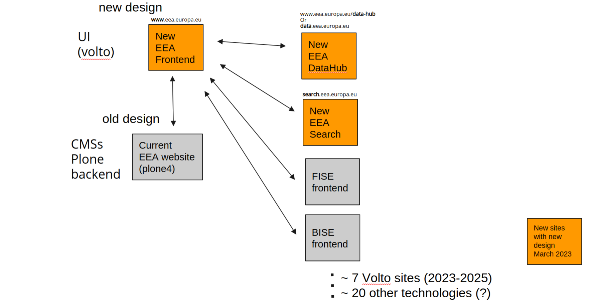

---
class:
  - invert
headingDivider: 2
theme: gaia
style: |
---
  

<!-- _class: lead invert

backgroundImage: linear-gradient(to bottom, #00228A, #2e5747)
-->

<!--

steps, practical examples

we want 3 things, like EC design system:

- usage
- showcase
- storybook

maintain the design system, main components, we import the release

sui code, react components, releasable, we can import in our volto theme setup and they must have a Plone

show a presentation of how to get started.

show a workflow diagram on how they should work.

components library exist, we don't have the design system, that's what's inside react.

show them examples, they have to do.

we want to deliver the specification for them.

- how they should develop this,
- how they should deliver this
- how they should maintain the library, they have to be maintainers, it's their main delivery, we have to establish a colaboration system for back/forth.

- technical requirements ambition level. Get a feeling from their team.

- what we want from the design system. Show EC example, explain instead of that code we want SemanticUI code, the contents are almost the same.

- We need things releasable, so we want a library with a theme and components. Development workflow with a diagram on how they deliver, how we use them.

- We're gonna have a test site. Practical 'how to deliver, how to develop'. Document how to make the documentation.

- Already schedule some more in-depth meetings for specific things: how to do stuff with Volto.

====] Timeline of meeting, Agenda: [====

- short intro from Antonio + Marie
    - they need to work with us
    - expected delivery + deadlines
- short intro on the projects we do. Show Volto websites
- theming system in Volto (semanticui, themes, react components)
- design system details
- development workflow. Document the documentation.
- discuss the need for test site
- schedule new meetings for specific sites
-->

# EEA Design System

<!-- _class: lead invert -->

# EEA CMS

- We use Plone 6 CMS
- Everything is open source
- React frontend (Volto)

## The websites

<!-- _class: twocolumns invert -->

- EEA IMSv4
  www.eea.europa.eu/ims
- FISE
  forest.eea.europa.eu
- BISE
  biodiversity.europa.eu
- WISE-Freshwater
  water.europa.eu/freshwater
- Climate-Energy
  climate-energy.eea.europa.eu
- Industrial Emissions
  industry.eea.europa.eu
- Land Copernicus
  clmsdemo.devel6cph.eea.europa.eu
- EEA Search (new, one page data catalogue)
  search.ai-lab-aws.eea.europa.eu
- Datahub (new)
  data.eea.europa.eu ?

and more to come

## EEA applied Design System overview

# EEA editing process

- WYSIWYG editing
- Pages are composite pages, text intermixed with more complex blocks
- System similar to Wordpress Gutenberg, Google Docs, Medium, Facebook Pages

Example of [complex page](https://www.eea.europa.eu/publications/europes-changing-climate-hazards-1/climate-hazards-indices): see EEA Briefings

# Volto theming system

- SemanticUI CSS framework. Based on LESS
- SemanticUI-React for components
- Custom EEA addons
- Each EEA website has its own 'from scratch' Volto theme

### We want a common base theme. "EEA Design Theme"

# The EEA Design System

**Creation and maintenance of a design system:**

- Similar effort to Europa Component Library
https://ec.europa.eu/component-library/ec/
https://github.com/ec-europa/europa-component-library
- EEA Design System repo:
  https://github.com/eea/volto-eea-design-system

<!--
- Branding, high level specification
- Complete design system as a static website
- Integrate SemanticUI + React
- Iconography
- Github repos

See:

- Awesome Design Systems https://github.com/alexpate/awesome-design-systems
-->

## Involved teams and overall workflow

# Deliveries

- Requirement 1 — **High-level branding** (1 Jan)
- Requirement 2 — **Core Semantic UI theme and components** (End-Jan 22)
- Requirement 3 — **All design elements** (End-Feb 22)
- Requirement 4 — **New website sitemap** (End-feb 22)

Second contract

- Requirement 5 — **New Homepage** (End-May 22)
- Requirement 6 — **Detailed layout for each of the main sections** (top navigation) (End-May)

**On-demand support** to apply design system to specific web
  applications - continuous activity until launch date March 23

Based on **"Web UX requirements and timeline"** document

# Requirement 1 - High level branding

**Delivery by 15 Dec 2021**

- 3 different mockups of branding to (COM) EEA UX Team

**Delivery by 1 Jan 2022**

- High level branding
- Design principles
- Applied branding to standard template
- **Approved** Figma (or similar) layouts

Creation of a high-level branding concept and design principles for the EEA and
its family of websites, taking into consideration pre-existing work (EEA logo,
corporate color palette) (see annex 10), design of EEA printed products,
current web design elements.

##

This would also include

- Colors
- Typography
- Main grid

Not in scope in this delivery:

- branding of printed material, e.g. reports, posters.

Standard template (site header, page header, page footer, site footer) e.g.,
https://ec.europa.eu/component-library/ec/standardised-template/

##

**Applied branding**

Specific example of branding applied to an **EEA standard webpage** (e.g.
article/briefing):

- Layout example of a webpage with applied template, in 3 main layouts:
  - Mobile (vertical)
  - Tablet/mobile-landscape (landscape)
  - Desktop

(This does not include the 3 mockups that are to be delivered to COM by 15
December)
##

**Mobile first**

Design proposals should start with the smallest resolution and viewport in mind
(mobile-first), and progressively create layouts for the next resolution and so
on (progressive enhancements).

**Mobile**: Provide a design for mobile displays with size 360×640 (this will help
us create a fluid design from 360×640 through 414×896)

**Tablet**: Provide a design for tablet displays by giving a design with size
768×1024 (this will help us create a fluid design from 601×962 through
1280×800)

**Desktop**: Provide a design for desktop displays by giving a design with size
1366×768 (this will help us create a fluid design from 1024×768 through
1920×1080)

# Requirement 2 — Core Semantic-UI theme

**Delivery by End-Jan 2022**

- Design system static website
- Semantic-UI theme and themed components

<!--
Branding applied to Semantic UI core elements - https://react.semantic-ui.com/
-->

## Design system as static website

- Use Docusaurus and Storybook
- Deploy on https://design.eea.europa.eu and
  https://design-storybook.eea.europa.eu
- Content similar to Europa Component Library (ECL)
- Include Semantic-UI-React themed components

### Implemention

Should be a part of https://github.com/eea/volto-eea-design-system

<!--
Based on these new branding and design principles, implementation of
  a complete online design system. The design system is to be published as
  a website under the EEA domain, e.g., https://design.eea.europa.eu (using
  Docusaurus and Storybook) documenting and showcasing all elements of the new
  design. Its content is expected to be similar to
  https://ec.europa.eu/component-library/ec/ with EEA specific needs.
  -->

## Content of design system website

Including, but not limited to:

- **Core branding**: colors, typography, spacing, general page structure (alignment, high-level page structure)
- **Core Semantic-UI React components**
- **Low-level EEA components** for EEA websites

**Post-milestone**

In time, all layouts and components need to be added to the EEA Design System.

<!-- these are the elements that we'll watch out for (coming in the next
slides) -->

## Core Semantic-UI React components

<!-- _class: invert columns -->

- Button
- Container
- Grid
- Card
- Item
- Segment
- Statistic
- Form
- Input
- Table
- Message
- Header
- Image
- Label
- Dropdown
- Menu
- List
- Accordion
- Popup
- Progress
- Checkbox
- Confirm
- Modal
- Breadcrumb
- Tab
- Radio
- Pagination
- Comment, etc

## Low-level components for EEA websites

<!-- _class: invert columns -->

- Table of Contents
- Blockquotes
- Pullquotes
- Timeline
- Page
- Banner
- Featured Item
- Inpage navigation
- Grids
- ... etc.

Identify **more core EEA components** from EEA websites!

## Grid layout

HTML/CSS/JS with grid layout for a Standard page/Article/News/Briefing

Grid for main site template.

"Content grid" for the article page.

https://ec.europa.eu/component-library/ec/standardised-template/

## Semantic-UI Theme and React components

**Components and CSS Implementation**

- The design system will be based on specific Semantic UI React-components
  (https://react.semantic-ui.com/elements/header/), that will need to be styled
  according to the EEA design systems and then re-used by designers and web
  developers working in other projects/contracts at EEA.

# Guiding principles

### Accessibility

- Highly accesible implementation of components is expected. See WCAG 2.0
(A/AA/AAA) accessibility standards and requirements

### Iconography as SVG

- Iconography for the new design system, in vector format as SVG icons library.

We're using FontAwesome-derived icons. New icons should be delivered as SVG
icons.

##

### Github repos

All the source code and design system deliverables will be managed in
specific repos in EEA GitHub (https://github.com/eea) and design system
website hosted at EEA.

EEA Semantic-UI Theme:
https://github.com/eea/volto-eea-design-system

This repo should also host the Docusaurus, Storybook, Figma and designer kits
implementations.

##

### Development workflow

Use Gitflow-based development workflow. Master branch is protected, separate
PRs for features/bugfixes to the develop branch. Releases are produced by
merging develop to master.

Use semantic-versioned Github releases. Ex:
https://github.com/ec-europa/europa-component-library/releases

### Software quality

Webscore - https://webscore.eea.europa.eu

# Requirement 3 — all design elements

**Delivery by End-Feb 2022**

- Content types and variations
- Port EEA specific design elements to Semantic-UI

##

- Standard web page
- Article/News/Briefing (Web report)
- Report (with one or more PDFs)
- Web report
- Indicator
- Visualizations:
  - Map (static/interactive)
  - Chart (static/interactive)
  - Dashboard
  - Infographic
- FAQs

##

Views:

- Listing of pages
- Card
- Form elements
- Search pages

<!--
##

Porting the EEA specific design elements from existing Web design style guide
to Semantic UI:

- Layout
- Elements
- Components
- Old TinyMCE styles
-->

## Deliverables

HTML markup expressed as **React components** library, CSS stylesheet library
integrated with Semantic-UI. Should include variations for responsive design.

# Requirement 4 — New website Sitemap

**Delivery by End-Feb 2022**

The information architecture.

At least 3 levels of depth of the new website sitemap (including datahub and
linkages to the other EEA websites). Description of each of the sections and
pages of the new sitemap.

##

Specification of customization of EEA branding for:

- Co-owned site, community managed: EEA + partner, e.g., Climate-Adapt, BISE,
WISE, FISE…
- Non-EEA sites, like Copernicus sites (have own defined branding and design
system)
- Network sites like https://epanet.eea.europa.eu/
- Eionet websites? (There is consensus to merge Eionet with EEA site).

##
**Delivery details**:

Sitemap specification using template XYZ (e.g.
https://templatelab.com/file/95232/)

# Requirement 5 — new Homepage

**Delivery: End-May 2022**

Deliveries:

- Approved Figma layouts in 3 layouts (desktop, tablet, phone)
- Implemented HTML elements in design system

# Requirement 6 — Detailed layout for main sections

**Delivery: End-May**

(each of the top navigation)

Deliveries:

- Approved Figma layouts (desktop, tablet, phone)
- Implemented HTML elements in design system

# Requirement 7 — On-demand support

On-demand support to apply design system to specific web applications
- continuous activity until launch date March 23

At least one front-end developer and at least one UX designer available on
a daily basis for supporting the Web Development Team (DIS1) on implementation
of design.

- UX and design support for the new EEA website
- UX and design support for the new EEA search
- UX and design support for the new Data hub

## Maintainance, further development of the design system

- Maintain and develop further the design system
- Integrate with other systems (EEA Semantic Search)

# More to come

- Datahub frontpage design delivery
- EEA design system applied to Plotly charts. The UX contractor would need to
also provide examples and themes for the Plotly charts, that we can integrate
in the Plone components.

## Follow-up meetings

Schedule follow-up meetings.

- Establish direct contact points with ITML UX/frontend developers to EDW
  developers (Tibi+David)
- Mini-training on Volto theming and release process
- ?

## Demo site

We want to have a demo website with the design system in place.

- demo-www.eea.europa.eu - live website with EEA Design System CSS in use
- design.eea.europa.eu - static website design system
- design-storybook.eea.europa.eu - Storybook stories, linked from the design system

## Working teams

- EEA staff & editors
- EDW website developers
  - backend
  - frontend
  - devops
- ITML design + UX + frontend

## Resource people

- David Ichim, main EEA website frontend developer
  - EEA frontend expert

- Tiberiu Ichim, lead developer for thematic websites
  - Volto systems expert

- Backup: Alin Voinea, lead developer EEA website
  - DevOps, Development process expert

Contact on EEA Riot, "EEA Design System" room.

Who is ITML contact point?
