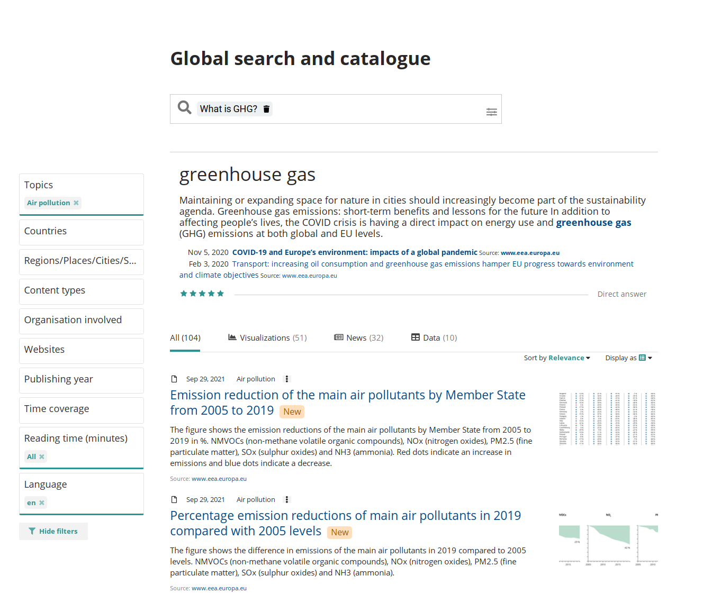
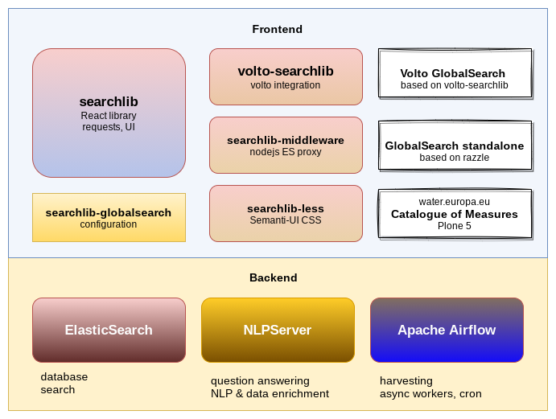

---
class:
  - invert
headingDivider: 2
theme: gaia
style: |
---
  

<!-- _class: lead invert

backgroundImage: linear-gradient(to bottom, #00888A, #086ca3)
-->

# EEA Searchlib

### Volto-integrated advanced search library
### all open source

## Developers

- Tiberiu Ichim
- Zoltan Szabo
- Ghita Bizau

## History

<!--
When it come to an organisation such as EEA, with a lot of specialized content,
having a good search integration becomes a high priority. So we have seen
development, over the years, of several search products, and many of them are
still in use.
-->

## eea.facetednavigation

- Runs on Plone
- Backend: ZCatalog

<!--
It is a complex and somewhat complete search solution for Plone websites.

Advantages: somewhat easy to setup
Disadvantages: limited fulltext search capabilities, uses Zope catalog, you can
only search Plone content
-->

## eea.searchserver.js

- Backend: Elasticsearch
- JQuery

## EEA Global Search

- indexes many EEA websites
- source sites initiate ping
- data is harvested from Plone eea.rdfmarshaller view
- stored in Virtuoso
- downloaded with SPARQL

<!--

Hard to integrate on other systems. But it has been done.

The global search solves a unique problem, though, which is that of indexing
and cataloguing many EEA websites. We index the websites using a ping process
(initiated by the site) and the information will be gathered from the source
website in RDF format and stored in a Virtuoso database, for which we have
a SPARQL endpoint. From that sparql endpoint

Hard to further develop, basically a one man show (Zoltan).
-->

## eea.searchserver.js

Climate-Adapt

## eea.searchserver.js

FISE

## volto-searchkit

- ES + Volto
- github:eea/volto-searchkit
- github:searchkit/searchkit

<!--

When I've started to work on BISE and we needed the catalogue, I knew that
integrating the eea.searchserver.js will be a hard task. And we already had the
ElasticSearch indexes prepared, which would have probably been incompatible
with eea.searchserver, so we went the route of implementing an integration with
ES that runs as volto block.

So this is the first search engine I built with Volto and React. Fortunately I was
able to use a React library, Searchkit v2, which made things really easy
-->

## One search appliance to rule them all

<!-- _class: lead invert -->

##

<!--
So now we arrive at the subject of this presentation.

Searchlib is the internal name, but it represents a bunch of various packages.

The idea is to create a library, on top of React, that can be used to build
Elasticsearch-powered search engines, with a dash of semantic search and NLP
thrown on top.

-->

## Modern UI initiative

<!--
One of the main problems with the old search engine was also of UX. This could
have been potentially solved in the old engine, but being based on JQuery and
limited to a single guy that really knew what was going on, it was impossible.
Also, you don't dump money in outdated technology
-->

## Working configurations

- Single Page Application
- Integrated with Plone4/5
- Node.js based, Razzle-powered Standalone
- Volto block

<!--
In theory we cover almost any configuration, and this is already working
code, not something that we'd like to do in the future.

For the future we want to provide alternate, minimal views, such as minimal
listings, featured items, etc.

-->

## Apache Airflow harvester

gh:eea/eea-crawler

<!--
We use Apache Airflow as a task runner. We chose Airflow because of wide
community backing. Now, Airflow is maybe not the best choice for the task we
had ahead of us, but we managed to achieve all of our goals, which is to have
a dynamic harvester.
-->

## Task 1: crawl a Plone website

<!-- Airflow uses configuration scripts for its workflows, which it calls DAGs
- directed acyclical graphs. These dags can't be fully dynamic, so we chain
  dags, we have a task that can be part of a DAG and can trigger another DAG
  run.

-->

## Trigger a DAG

<!--
We can manually trigger a DAG, starting with a JSON configuration parameter,
but most of them run via Airflow internal cron scheduller.
-->

## Dynamic pools

<!--
We create and assign a task pool for each website and dynamic pools are not
supported by Apache Airflow, if you're curious, check out our code.

Once created, the pools are persistent and can be adjusted to the number of
  slots, which is how many tasks can run on that "pool" at one time
-->

## Task 2: stash documents in ES

<!-- Now we stash the documents in ElasticSearch. From here we have a bunch of
many dag triggers which process each document and run it through our NLP
pipeline -->

## Task 3: extract, enrich

<!-- We crawl every URL with a headless browser, extract the HTML and convert
to plain text with a Python library trafilatura. This is just for the main
portion of the text, the metadata is directly extracted via plone.restapi
-->

## NLP Server

- Python, FastAPI
- gh:eea/nlp-server
- gh:deepset/haystack
- Tranformers, HuggingFace

<!-- Runs

Now, this is probably my third NLP server that I have written so far. I hope
it's the last, as the pace of development in the open source field of NLP and
machine learning is awesome these days. Many tech giants opensourced not only
their code, but also their trained models, as that is one of the biggest
hurdles in sucessfully implementing ML-based products. So, this time the NLP
service is a rather thin wrapper on top of top libraries such as Haystack,
Transformers and the HuggingFace model repository.

The NLP server can selectively run all its configured services, so it's
possible to scale certain services from the deployment infrastructure.

We plan on adding more services. If we have time, I can demonstrate some of the
things that it can do right now.
-->

## NLP Server Configuration

.yml based pipeline configuration

## QA process

- models trained with dual-encoder framework
- topK results are retrieved from document store
- Reader model reads docs and extracts answers

<!-- Because on the fly tokenization and vectorization is rather expensive, the
usual process is to retrieve the "best candidates" using either a dense
retriever (a vector capable database, such as Weaviate or Faiss) or sparse
(simple Elasticsearch BM25 ranking), then these candidates are passed to the
Reader model, which extracts and ranks the answers from the candidates.
-->

## Current status

- Launch due in March 2023
- Already in use as non-NLP integrated app

<!--
    QUESTIONS = [
        "what is the status of our forests",
        "what is PFAS?",
        "how does PFAS get into human?",
        "what is the cumulative surface area of the Natura 2000?",
        "what percentage of europe population is connected to waste water treatement?",
        "How is the status of fish species in Europe?",
        "What is the BISE?",
        "how much does transport contributes to GHG emissions in EU?",
        "Which cities in Europe have the worst air quality?",
        "What car is best for the environment?",
        "What transport mode is best for the environment?",
        "What EU legislation safeguards our water?",
        "What is land accounting?",
        "What countries had the highest land take in the EEA-39 between 2000 and 2018?",
        "Why is urban sprawl bad?",
        "what are controlled substances",
        "what is plastic",
        "What year did car manufacturers meet their binding emissions target?",
        "What is the percentage of surface water bodies with less than good status?",
        "What is the most common pollutant in water bodies in Europe?",
        "Where can I access greenhouse gas data",
        "What is the trend on greenhouse gas emissions from transport",
        "what is the best transport mode",
        "what are ecosystem services",
        "bathing water quality",
        "greenhouse gas emissions trends",
        "waste generation trends",

how covid contributes to pollution?
who is the director of EEA?
what are the problems for clean waters
which is the most ecological means of transportation?

tag aici
https://github.com/eea/semanticsearch-frontend/blob/develop/package.json
-->

## Thank you!
