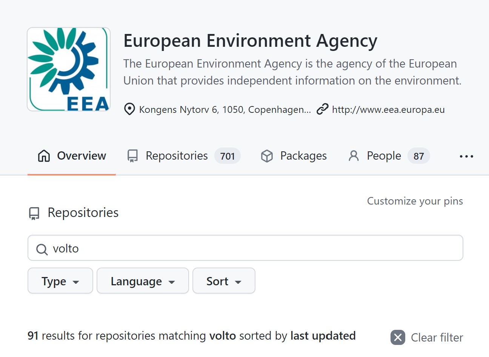

---
class:
  - invert
headingDivider: 2
paginate: false
theme: gaia
style: |
    section {
    }
---


<style>
  .hljs-name {
    color: #7ee787 !important;
  }

  .hljs-tag {
    color: #79c0ff !important;
  }

  section.invert {
    --color-background: #33507a!important;
    padding: 2em 4em !important;
  }

  section code {
    color: #c9d1d9 !important;
    background: #161b22 !important;
  }
</style>

# Volto Pluggables
<!-- _class: lead invert -->

## tl;dr
<!-- _backgroundImage: "linear-gradient(to bottom, #67b8e3, #0288d1)" -->

```jsx

<Pluggable name="document-top" />

//...

<Plug id="quicklinks" pluggable="document-top">
  <Button />
</Plug>

```

<!--
Now that you know (almost) everything you need to know about Pluggables, you
can decide if you wish to stick around and get into the "abstract".

It's gonna be pretty light on technical content, but heavy on personal
impressions.

Right now we have two systems running in parallel: Classic Plone and Volto and
at first glance they appear to be nearly equivalent. I think Volto is a big
evolutionary step for Plone and to get similar capabilities you'd basically have
to rewrite Volto.

Disclaimer: I'm gonna talk about Volto's Pluggables implementation. I am the
author of the Volto port, but I'm not its initial author. There's many
implementations in the React community, Wordpress Gutenberg has them as "slot
fills". This is a port of react-fill-slot.
-->

## Who am I?

- Tiberiu Ichim
- Zope and Plone developer since 2003
- Eaudeweb
- main client: EEA

<!--  4 minutes

- me
- client is EEA, big, early
- starting history
- moving to Volto
- strong CMS

For those of you who don't know me, my name is Tiberiu, I'm a Plone/Volto
developer working with Eaudeweb Romania. I'm a Volto contributor and I've
been developing websites with Volto for about 2 years.

Our main client for the Volto websites is EEA, the European Environmental Agency.
Through our work, they are a big contributor to the Volto ecosystem and they're
one of the so-called early adopters of Volto.

Many of the public EEA sites are now already on Volto or in the process of
being migrated to Volto.

One particularity of these websites is that the CMS side is very strong: there
is a lot of technical content, so with our websites we focus mostly on
delivering the tools that will be used. With Volto we've been able to make
the process of publishing environmental data feasible for website editors and
not just dedicated contractors.
-->

## Addons

<!-- _backgroundImage: "./statics/eea-volto-gh-search.png" -->



<!--
- how do we scale Volto?
- addons story was first big contribution
- > 80 addons, all open source

One of our first concerns was: how do we scale Volto? We knew our work
landscape: multiple websites, small teams, so the "addons story" was one of the
big first contributions that we made to the Volto project.

Since then EEA has published over 80 open source Volto addons, websites, Plone
integration addons, etc. All open in the EEA github organisations. So if you're
looking for real examples on how to achieve something with Volto, there's
plenty of examples. And of course there are many companies with open source
code: RedTurtles, CodeSyntax, Rohberg and of course KitConcept. See the Volto
readme page for this.

-->


## Addon to an addon

- how do you express that as a pattern?
- we need Volto's equivalent of ZCA

<!--
- we've scaled Volto with addons
- some addons already have 3-4 addons
- we need deeply integrated extensibility
- volto is dev friendly, so avoid complexity

So far we've scaled Volto with addons. But we're already starting to see that
some addons need to provide extension mechanisms. volto-slate has 3 or 4 addons
that extend it. We're always finding new ways to "abuse" the columns block
or tabs block, etc.

So we need a deeply integrated extensibility, just like Plone has with ZCA.

One of the things that make Volto really attractive is developer friendlines.
I've seen this many many times already, new developers can become productive
very fast with Volto. So we have to keep things light and understandable and
don't scare them with dependency injection or component lookup in an opaque
registry.
-->

## Scaling up Volto interactions
<!-- _class: lead invert -->

<!--

Pluggables provide a way scale up Volto interactions and I'll walk you through
to a better understanding of this.
-->

## React data flow

- In React, data flow is top to bottom
- "out of tree" data needs Redux
- how to interact with foreign components?

<!--
-  react data flow freezes components
- that is a good thing. Concurency, debugging, 2-way databinding nono

In React world the "top-bottom" approach is strict. Components pass properties
to their children, children can call functions passed down as props. To enable
communication between arbitrary component trees you need Redux (or something
equivalent). Why? Components need to "update" when state outside them changes.

This makes the components "frozen" in their implementation. We can make them
configurable and extendible, but we need to explicitely program and design this
extensibility for each one of them. One example of an explicit extensibility
mechanism is Volto's "block variations", where you have to write to a central
registry.

When programming Plone the ZCA is its most basic language. Everything is
a component, writing an interface and an adaptor is the most natural thing.
Because of this, we're pretty much guaranteed pluggability almost everywhere.
-->

## UI state is fluid

<!-- _class: lead invert -->

<!--
The global state is always in flux, and it doesn't always model real data
coming from the server or what not, but also the state of interactions. Trying
to model all these transient things as configuration will be really hard and
we'll just end up relying on a lot of documentation and lookup keys.
-->

## Do we need pluggability?

- Pluggable = reusable, scalable
- Pluggability is hard. Design upfront.
- Volto blocks are extensible through dedicated API
- How deep to go with declared configuration?

<!--
- Components can now declare "slots"
- Replaces `<Portal>`
-

Pluggability enables scalability and reuse. Because of "programmed" (via the
configuration) pluggability, Volto blocks can be recycled: a new view template
can reuse the block data to show things in a different way, the variations can
extend the block schema model to add new features to the block.

But pluggability is also hard: it requires designing an API and a pluggability
model. With ZCA this is reduced as there are already established patterns and
best practices.
-->

## Pluggables = on-demand viewlets

<!-- _class: lead invert -->

<!--
Volto's pluggability needs are usually visual but also based on interactivity
(it's an UI, after all).

A good example of pluggable UI in Plone is the viewlet manager. You declare it
once, you include it in the template and it will render things inside it.

But this is now "viewlets for Volto". We've been doing websites with Volto, so
obviously they're not 100% essentials. This is about going way beyond that
traditional use case.
-->

## `<Pluggable>` = `<browser:viewletManager>`

```
<browser:viewletManager name="aboveDocumentTitle" />
```
vs

```
<Pluggable name="aboveDocumentTitle" />
```

## `<Plug>` = `<browser:viewlet>`

```
<browser:viewlet manager="" />
```
vs
```
<Plug pluggable="aboveDocumentTitle" id="title" order={100} />
```

<!--
But Plone's "pluggables" are quite static. You can trace the request-publish
cycle all the way to the CGI and the beginning of web apps. Request, response,
rinse, repeat.

With Volto being a SPA, the whole application state is continously shifting and
mutating. The interactivity in Volto needs to go beyond "display this
additional thing here". It even needs to allow inter-component communication,
passing down props "out of tree" and more, as a generic framework.
-->

## Advanced patterns

- Overwrite a <Plug> with a <Plug>

```jsx
<Plug id="delete-button" pluggable="toolbar"><Button color="blue"></Plug>
```

Later, render a Plug with the same id

```jsx
<Plug id="delete-button" pluggable="toolbar"><Button color="red"></Plug>
```

<!--
- Plugs can override other plugs. Watch out for the "dependencies" prop to make
  sure you keep the best one "alive" `<Plug dependencies={[...]}>`
-->

## Advanced patterns (2)

- Read data from the <Pluggable>

```jsx
<Pluggable params={{color: 'red'}}>
```


<!--
- Plugs can read data from the Pluggable. `<Pluggable params={...}>`
-->

## Interact with the pluggable!

- Pass down a function from the <Pluggable>!

```jsx
<Pluggable params={{onChangeColor: (c) => setColor(c)}}>
```

## Use cases

- Toolbars
- The Quanta Toolbar

<!--
- Toolbars hit all the marks for Pluggables: they're highly interactive,
  dependent on context

- The Quanta toolbar: the convention is that each block has a single toolbar.
  But what if we want to add things to that toolbar, things that make sense in
  other non-standard use case, for example reuse the blocks as slots and add
  slot-specific buttons.

- What if an addon wants to add a button? For example, right now
  volto-block-style needs to add a button to the right-top-side, as there's no
  pluggable way to add controls to blocks. A guaranteed pluggable toolbar for
  blocks would enable that.
-->

## Showcase
https://github.com/plone/volto/blob/2d8f943a8c82795b2068b58a2a7c07c56fd41d80/src/components/manage/Blocks/Block/GroupedMenuButtons.jsx

## Limitations

- No SSR
- Watch for dependency lists!
- Limited adoption (yet)

<!--
Pluggables are not SSR-enabled. Is this a problem? Not really. Slots are an
alternative and the plan is to make slots pluggables-enabled.
-->

## Implementation (simplified)

The context

```jsx
<PluggablesProvider>
  <Pluggable name="top" />
  <Plug id="delete" />
</PluggablesProvider>
```

<!--
The key to understanding Pluggables is in understanding the implementation.

<PluggablesProvider> provides a context and a state. As use effect, plugs write
their children into that global context. Pluggables subscribe to that global
state and render the "Plug renderers".
-->

## ...

The Plug

```jsx
const Plug = ({id, children}) => {
  const { register } = useContext(PluggablesProvider.Context);

  React.useEffect(() => {
    register(id, () => children);
  });

  return null;
}
```

## ...

The Pluggable

```jsx
const Pluggable = (name) => {
  const { getPlugs } => useContext(PluggablesProvider.Context);
  return getPlugs(name).map(f => f());
}
```

## Thank you!
<!-- _class: lead invert -->
