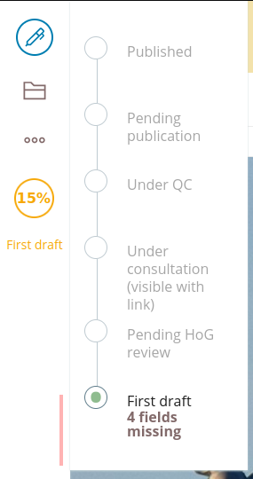
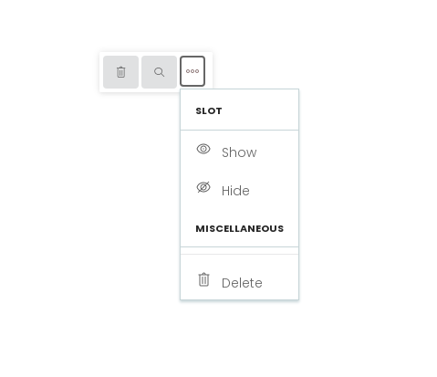
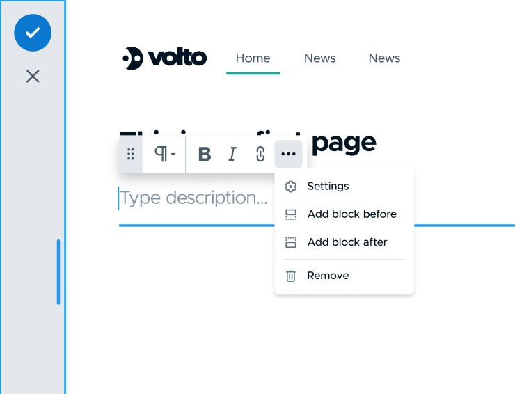

---
class:
  - invert
headingDivider: 2
paginate: false
theme: gaia
style: |
    section {
    }
---


<style>
  .hljs-name {
    color: #7ee787 !important;
  }

  .hljs-tag {
    color: #79c0ff !important;
  }

  h2 {
    font-family: serif;
  }
  section.leftbg h2 {
    text-align: left !important;
  }

  .leftbg h2 {
  }

  section {
    font-size: 1.6rem;
  }
  section.invert {
    --color-background: #33507a!important;
    padding: 2em 3em !important;
  }

  section code {
    color: #c9d1d9 !important;
    background: #161b22 !important;
  }
  img {
    max-height: 80vh;
    max-width: 100%;
    text-align: center;
  }
</style>

# Volto Pluggables
<!-- _class: lead invert -->

## tl;dr

```jsx

<div className="toolbar">
  <Pluggable name="toolbar-main" />
</div>

//...

<Plug id="quicklinks" pluggable="toolbar-main">
  <Button />
</Plug>

```

Volto port of https://github.com/robik/react-view-slot

<!--
Now that we got the basics out of the way, let's see what else there is to
learn about them.

Right now we have two systems running in parallel: Classic Plone and Volto and
at first glance they appear to be somewhat equivalent. But I think Volto is
a big evolutionary step for Plone and to get similar capabilities you'd
basically have to rewrite Volto. And Pluggables is an example of the kind of
thing that marks the departure from the classic "static page" or "static page
with JS-based interaction".

Disclaimer: I'm gonna talk about Volto's Pluggables implementation. I am the
author of the Volto port, but I'm not its initial author. There's many
implementations in the React community, Wordpress Gutenberg has them as "slot
fills". This is a port of https://github.com/robik/react-view-slot
-->

## The Big Picture

* EEA: early adopters
* strategy: move to Volto
* less brochure, more CMS
* complex types, mixed content


<!--

For those of you who don't know me, my name is Tiberiu, I'm a Plone/Volto
developer working with Eaudeweb Romania. I'm a Volto contributor and I've been
developing websites with Volto for about 2 years.

-[next]

Our main client for the Volto websites is EEA, the European Environmental
Agency. Through our work, they are a big contributor to the Volto ecosystem and
they're one of the so-called early adopters of Volto.

-[next]

Many of the public EEA sites are now already on Volto or in the process of
being migrated to Volto.

-[next]

One particularity of these websites is that the CMS side is very strong: there
is a lot of technical content, so with our websites we focus mostly on
delivering the tools that will be used to produce the content. With Volto we've
been able to make the process of publishing environmental data feasible for
website editors and not just dedicated contractors.
-->

## Add-ons

<style>
  img {
    width: 60%;
  }
</style>


<!--
- how do we scale Volto?
- addons infrastructure was first big contribution
- > 80 addons, all open source

One of our first concerns was: how do we scale Volto? We knew our work
landscape: multiple websites, small teams, so the "addons infrastructure" was
one of the big first contributions that we made to the Volto project.

Since then EEA has published over 80 open source Volto addons, websites, Plone
integration addons, etc. All open in the EEA github organisations. So if you're
looking for real examples on how to achieve something with Volto, there's
plenty of examples. And of course there are many companies with open source
code: RedTurtles, CodeSyntax, Rohberg and of course KitConcept. See the Volto
readme page for this.

-->


## Add-on for add-on


- how do you express that as a pattern?
- we need Volto's equivalent of ZCA

<!--
- we've scaled Volto with addons
- some addons already have 3-4 addons
- we need deeply integrated extensibility
- volto is dev friendly, so avoid complexity

So far we've scaled Volto with addons. But we're already starting to see that
some addons need to provide extension mechanisms. volto-slate has 3 or 4 addons
that extend it. We're always finding new ways to "abuse" the columns block
or tabs block, etc. And we can't anticipate extensibility needs.

So we need a deeply integrated extensibility, just like Plone has with ZCA.

One of the things that make Volto really attractive is developer friendlines.
I've seen this many many times already, new developers can become productive
very fast with Volto. So we have to keep things light and understandable and
don't scare them with dependency injection or complicated component lookup in
an opaque registry.
-->

## Scaling up Volto interactions
<!-- _class: lead invert -->


<!--

Pluggables also provide a way scale up Volto interactions and I'll walk you
through to a better understanding of this.
-->

## React data flow

<!-- _class: lead invert leftbg-->


* In React, data flow is top to bottom
* "out of tree" data needs Redux
* how to interact with foreign components?

<!--
In React world the "top-bottom" approach is strict. Components pass properties
to their children, children can call functions passed down as props. To enable
communication between arbitrary component trees you need Redux (or something
equivalent). Why? Components need to "update" when state outside them changes.

This makes the components "frozen" in their implementation.

-[next]

We can make them configurable and extendible, but we need to explicitely
program and design this extensibility for each one of them. One example of an
explicit extensibility mechanism is Volto's "block variations", where you have
to write to a central registry.
-->

## UI state is fluid


<!-- _class: lead invert -->

<!--
The global state is always in flux, and it doesn't just model real data
coming from the server, but also the state of interactions. Trying
to model all these transient things as configuration would be really hard and
we'll just end up relying on a lot of documentation and lookup keys.
-->

## Do we need pluggability?


- Extensible = reusable, scalable
- Extensibility is hard. Design upfront.
- Many Volto things are extensible through dedicated API
- How deep to go with declared configuration?

<!--

Extensibility enables scalability and reuse. Because of "programmed" (via the
configuration) extensibility, Volto blocks can be recycled: a new view template
can reuse the block data to show things in a different way, the variations can
extend the block schema model to add new features to the block.

But extensibility is also hard: it requires designing an API and
a extensibility model. With ZCA this is reduced as there are already
established patterns and best practices.

When programming Plone the ZCA is its most basic language. Everything is
a component, writing an interface and an adaptor is the most natural thing.
Because of this, we're pretty much guaranteed pluggability almost everywhere.
-->

## Pluggables = on-demand viewlets


<!-- _class: lead invert -->

<!--
Volto's pluggability needs are usually visual but also based on interactivity
(it's an UI, after all).

A good example of pluggable UI in Plone is the viewlet manager. You declare it
once, you include it in the template and it will render things inside it.

But this is not "viewlets for Volto". We've been doing websites with Volto, so
obviously they're not 100% essentials. This is about going way beyond that
traditional use case.
-->

## `<Pluggable>` = `<browser:viewletManager>`

```
<browser:viewletManager name="aboveDocumentTitle" />
```
vs

```
<Pluggable name="aboveDocumentTitle" />
```

## `<Plug>` = `<browser:viewlet>`

```
<browser:viewlet manager="" />
```
vs
```
<Plug pluggable="aboveDocumentTitle" id="title" order={100} />
```

<!--
But Plone's "pluggables" are quite static. You can trace the request-publish
cycle all the way to the CGI and the beginning of web apps. Request, response,
rinse, repeat.

With Volto being a SPA, the whole application state is continously shifting and
mutating. The interactivity in Volto needs to go beyond "display this
additional thing here". It even needs to allow inter-component communication,
passing down props "out of tree" and more, as a generic framework.
-->

## The simple use case


```jsx
// in Volto
<Pluggable name="aboveDocumentContent" />
...

// in an add-on
const OnlineFriends = (props) => {
  //...
  return <Plug pluggable="aboveDocumentContent">
    <Message>Your friends {friends} are online!</Message>
  </Plug>
}

...
config.appExtras.push({path: '', component: OnlineFriends})
```

##

### Overwrite a <Plug> with a <Plug>

```jsx
<Plug id="delete-button" pluggable="toolbar">
  <Button color="blue">
</Plug>
```

Later, render a Plug with the same id

```jsx
<Plug id="delete-button" pluggable="toolbar">
  <Button color="red">
</Plug>
```

<!--
- Plugs can override other plugs. Watch out for the "dependencies" prop to make
  sure you keep the best one "alive" `<Plug dependencies={[...]}>`
-->

## Read data from the <Pluggable>


```jsx
<Pluggable params={{color: 'red'}}>

...

<Plug>
  {(options) =>
      <Header color={options.color}>Hello!</Header>}
</Plug>
```


<!--
- Plugs can read data from the Pluggable. `<Pluggable params={...}>`
-->

## Interaction child -> parent

- Pass down a function from the <Pluggable>!

```jsx

const [color,setColor] = React.useState('white');

<div style={{backgroundColor: color}}>
  <Pluggable params={{onChangeColor: (c) => setColor(c)}} />
</div>
```

```
<Plug>
{({onChangeColor}) =>
  <Button onClick={() => onChangeColor('red')} />}
</Plug>
```

## Keep <Plugs> alive

Control their lifetime and cycle with dependencies

```jsx
  <Plug
    pluggable={`block-toolbar-main:${block}`}
    id="mutate-block-button-classic"
    dependencies={[blockProps]}
  >
    <Button ... />
  </Plug>
```

<!--
-->

## Custom rendering of <Plug>

```jsx
<Pluggable name={name} {...rest}>
  {(pluggables) => pluggables.map((p) => {
    <div className="btn">{p()}</div>
  }}
</Pluggable>
```

## Showcase

**volto-workflow-progress** (main toolbar plugin)

**volto-editing-progress** ("sidebar" for plugin)



<!--

**PluggableMenuSection**:
automatically collapsible expandable toolbar


-->


## Use cases

- Toolbars
- The Quanta Toolbar



<!--
- Toolbars hit all the marks for Pluggables: they're highly interactive,
  dependent on context

- The Quanta toolbar: the convention is that each block has a single toolbar.
  But what if we want to add things to that toolbar, things that make sense in
  other non-standard use case, for example reuse the blocks as slots and add
  slot-specific buttons.

- What if an addon wants to add a button? For example, right now
  volto-block-style needs to add a button to the right-top-side, as there's no
  pluggable way to add controls to blocks. A guaranteed pluggable toolbar for
  blocks would enable that.
-->

## Limitations


- No SSR
- Watch out for dependency lists!
- Limited adoption (yet)

<!--
Pluggables are not SSR-enabled. Is this a problem? Not really. Slots are an
alternative and the plan is to make slots pluggables-enabled.
-->

## Implementation (simplified)

The context

```jsx
<PluggablesProvider>
  <Pluggable name="top" />
  <Plug id="delete" />
</PluggablesProvider>
```

<!--
The key to understanding Pluggables is in understanding the implementation.

<PluggablesProvider> provides a context and a state. As use effect, plugs write
their children into that global context. Pluggables subscribe to that global
state and render the "Plug renderers".
-->

## ...

The Plug

```jsx
const Plug = ({id, children}) => {
  const { register } = useContext(PluggablesProvider.Context);

  React.useEffect(() => {
    register(id, () => children);
  });

  return null;
}
```

## ...

The Pluggable

```jsx
const Pluggable = (name) => {
  const { getPlugs } => useContext(PluggablesProvider.Context);
  return getPlugs(name).map(f => f());
}
```

##
<!-- _class: lead invert -->


<!--
## Showcase
https://github.com/plone/volto/blob/2d8f943a8c82795b2068b58a2a7c07c56fd41d80/src/components/manage/Blocks/Block/GroupedMenuButtons.jsx
-->
