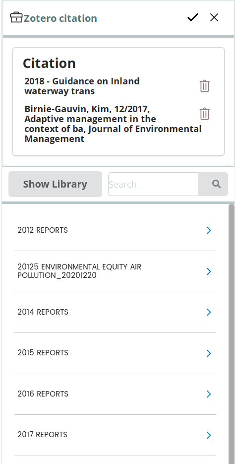
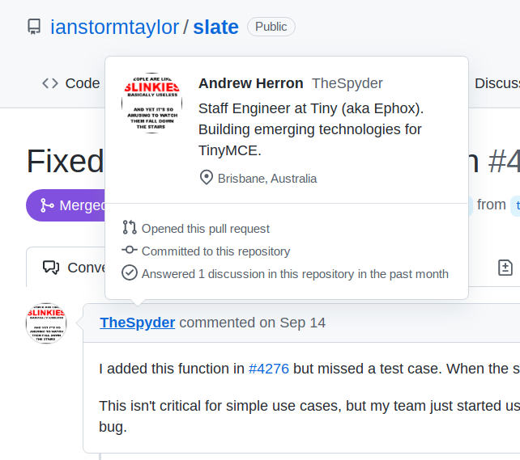
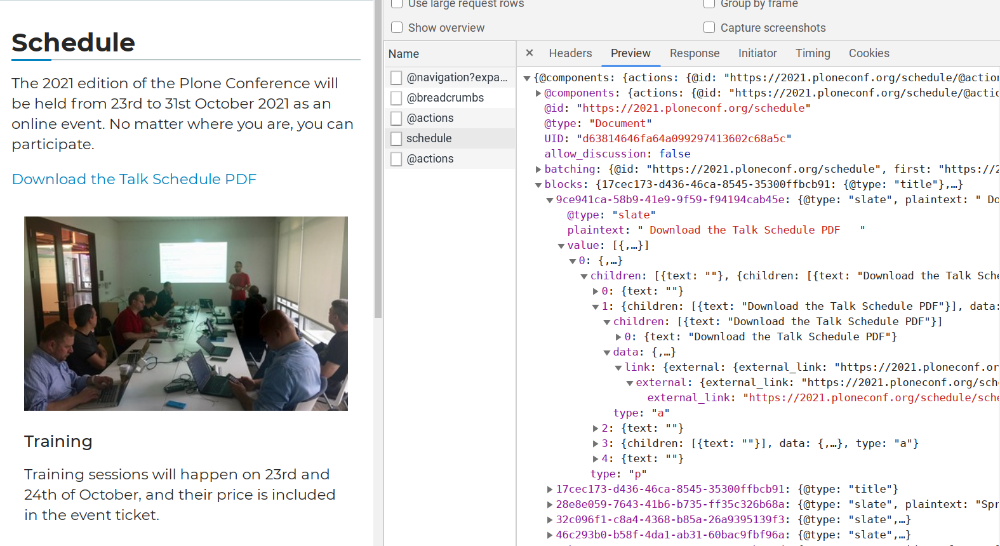
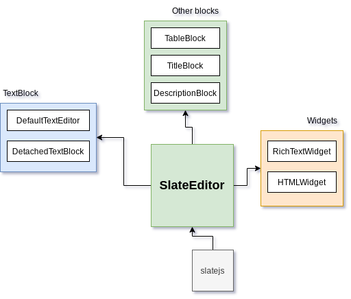
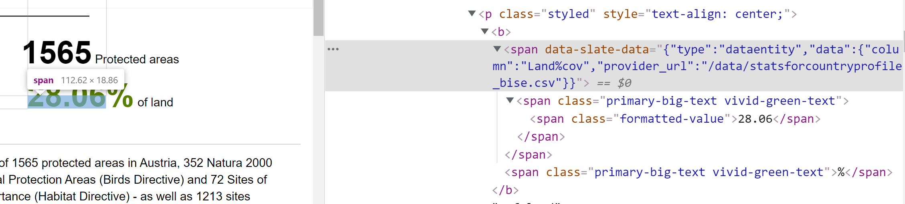

---
class:
  - invert
headingDivider: 2
theme: gaia
style: |
---
<style>
  .hljs-name {
    color: #7ee787 !important;
  }

  .hljs-tag {
    color: #79c0ff !important;
  }

  h2 {
    font-family: serif;
  }
  section.leftbg h2 {
    text-align: left !important;
  }

  .leftbg h2 {
  }

  section {
    font-size: 1.6rem;
  }
  section.invert {
    --color-background: #175E58!important;
    padding: 2em 3em !important;
  }

  section code {
    color: #c9d1d9 !important;
    background: #161b22 !important;
  }
  img {
    max-height: 80vh;
    max-width: 100%;
    text-align: center;
  }
</style>

# volto-slate
<!-- _class: lead invert -->

<!-- backgroundImage: linear-gradient(to bottom, #4A5B68, #175E58) -->

#### Tiberiu Ichim
##### Eau de Web


## What is volto-slate?


* developed for
  [Biodiversity Information System for Europe](https://biodiversity.europa.eu)
* the most important addon right now
* a richtext editor is uncool
* the first time Plone owns an editor?

<!--
I'm the original lead developer for volto-slate, it was developed as part of
the BISE project for EEA.

Probably the most important Volto addon, right now. If you start a new Plone
6 Volto project, it is one addon that you should include in your project.

Nobody wants to think about the editor. We mostly take them for granted. But
volto-slate is probably not even the fifth in line of Plone richtext editors
(Kupu, FCK, Tiny, Draft, etc).

Requirements change, the web changes, etc. And if I'd have time today, I might
even start another volto-slate alternative.

But right now it is the first time the Plone community owns an editor and
that is important and the consequences of that are far-reaching.
-->

## volto slate demo

* Almost boring, but that's good

<!--
It's boring, just like a text editor should be.

- Show off the style menu
- Show off editing data entities
- Show off editing footnotes, zotero
-->

## Used by...

* EEA, in all Volto websites
* Plone Foundation (2021.ploneconf.org)
* Kitconcept, Rohberg and others

## Top active developers & devops

- Silviu Bogan
- Alin Voinea
- Valentina Balan
- Tiberiu Ichim

## History


Create templated richtext documents?

<!--
- In my first Volto project, while working for forest.eea.europa.eu, we knew
  that we were going to have "factsheet pages", text that intermixed
  description with numbers coming from the database. We were also in a position
  where it wasn't clear, from the business point of view, what the final output
  would be, so I've had an idea to create a framework for "live documents", to
  make Volto as flexible as possible, so when the day comes, producing the
  final output will not be my job, as a programmer, but that of the site
  editors. Basically, we needed narative text for hard numbers coming from
  a database, and that text was out of my control.

  I've started working on new draftjs plugins, but I was having problems
  (components were not refreshing, draftjs API was bad) not a positive one
  experience. In reality I was trying to push it even beyond what was
  actually needed for the job.

  I was also hitting problems with the final output rendering: I didn't have to
  deal only with draftjs, but also differences and bugs in redraft, another
  library that can take draftjs trees and render them.

  Around spring 2020 we've started to draft the addon infrastructure, so I had
  the idea of creating an addon from scratch, to understand the needs of that
  addon infrastructure. As I've already wanted to test-drive slate, I've
  started to make a "toy addon", the volto-slate.
-->

# volto-slate ecosystem

<!-- backgroundImage: linear-gradient(to bottom, #4A5B68, #175E58) -->

<!-- _class: lead invert -->

## volto-slate-dataentity


## volto-slate-dataentity


<!--
slate-dataentity replaces placeholder text with values coming from database.
You can use, for example, a CSV file and add a lookup criteria (in our cases
it's country name, etc)
-->

## volto-slate-zotero


## volto-slate-zotero


## & more

- volto-slate-glossary @ Rohberg
- volto-slate-footnote
- volto-slate-metadata-mentions


<!--
https://biodiversity.europa.eu/countries/cyprus/edit
https://alin.dev2aws.eea.europa.eu/ims/test-alin-metadata-section/edit#ref-B6f3w
-->

## SlateJs vs DraftJS

- Slatejs is backed by a grassroots open source community
- Draftjs is OS project from Facebook

<!--
- TinyMCE developers are among SlateJs contributors
- SlateJS has a lot more OS activity and there's even contributions from TinyMCE
developers.

https://github.com/ianstormtaylor/slate/pull/4518
-->

## Slate gets ❤ from the industry



## Understanding SlateJS

* SlateJs is a low-level library, not an editor
* there's 0 knowledge about HTML in slate
* volto-slate builds an "HTML + more" editor


<!--

The key to understanding exactly what volto-slate is lies in understanding the
underlying library, SlateJS. SlateJS is not an editor, it is a framework to
build rich text editor. What types of elements, how they are rendered, etc,
nothing like that is defined in any of the slatejs packages.

With volto-slate we're trying to build a superset of an HTML-compatible
richtext editor. Why HTML compatible? Even if it's complex and we'd rather deal
with semantically marked up elements, being so ubiquitous,
interoperability will never be a problem. You will find libraries and tools to
handle it, and external systems (indexing, etc) are usually equiped to deal
with it.
-->

## Slate JSON data structure



## Always elements

<!--
Unlike other modern editors that use the concept of "marks" for decorative
tags (strong, em, etc), volto-slate always uses "hard" Element nodes. Initially
we've gone the 'marks' route as well, but switched when we've realized that
when ingesting HTML, there's no way to render identical markup similar to the
source. Example (pseudocode):

-->

No, we don't do this:
```js
{type: 'a', marks: ['strong']}
```

Because which one is it?

```html
<strong><a>I'm bold</a></strong>
```

```html
<a><strong>I'm bold</strong></a>
```

<!--
Does it matter? For styling purposes and
accuracy, yes, it does.
-->

## Slate elements

```jsx
{type: 'a', children: [{text: "I'm bold"}], data: {url: "http:..."}}
```

```
config.settings.slate.elements.a = \
  ({ children, element }) =>
    <a href={element.data.url}>{children}</a>
```

## volto-slate output rendering

```jsx
const serializeNodes(nodes) =>
  nodes.map(node => isText(node)
    ? <Leaf node={node}>{node.text}<Leaf>
    : <Element mode='view'>{serializeNodes(node.children)}</Element>);
```

<!--
Being close to the HTML DOM model, the rendering is a single recursive function
that just outputs React components and their children. (pseudocode)
-->

## Rendering to HTML

```jsx
ReactDOM.renderToStaticMarkup(serializeNodes(nodes))
```

<!--
This is just "converting", the actual rendering of the component is done by
React. To convert to real HTML, in the HTML-saving widget, we also use React.
`renderToStaticMarkup`
-->

## volto-slate understands Volto

- hit <Enter> in a text block will split text in two...
- unless you're in a list
- unless you're in a list but you make a headline
- <Backspace> at the beginning of a line joins it with the previous block
- traverse the blocks with up/down keys
- click focuses block

and much, much more

<!--

With volto-slate we've tried to anticipate the editor workflow, as they're used
to modern web editors. The quality of those web apps is extremely high and so
those expections are reflected also to interactions with Volto. The Volto
blocks presented a challenge, but the basic rule is obvious: one paragraph per
block, Volto provides separate blocks for things like images and tables.

do demo for traversing, sublists, etc
-->

## volto-slate takes over Volto

- paste HTML, you get multiple blocks
- pasted images are uploaded & converted to Volto image blocks
- pasted Google Spreadsheets are converted to Volto table blocks
- serves as target for drag/drop images from system


<!--
And because the basic slate block becomes the default UI for interaction,
we're also providing additional functionality:

- when pasting HTML, it converts it to Volto blocks: multiple paragraphs as
  multiple Volto blocks, images transformed to Volto image blocks, tables to
  Volto table blocks and so on.
- you can copy/paste a google spreadsheet and we'll convert it to a table
- you can drag/drop an image in a slate block and we'll create a new Volto
  image block.
  -->

## Layered architecture



<!--
The component hierarchy

At the root sits the SlateEditor component, it is the most basic one. On top of
it are built the block-level components (TextBlock with its DetachedTextBlock
variant), then RichTextWidget and HTMLWidget.

Despite all those Volto-blocks specific features, the TextBlock uses only
a couple of extra plugins to implement that functionality (mostly related to
keyboard) and a single principle: at the end of some operations (such as
paste), we call a single function, `deconstructToVoltoBlocks`, which
recursively looks up configurable `voltoBlockEmiters` to convert Slate nodes to
Volto blocks and then splits the multiple top-level nodes, each to a separate
block.
-->

## The Volto text block

Two modes:
  - single paragraph editor
  - detached

<!--
It works in two modes "detached" and "one paragraph per block". The detached
mode is a text block with multi-paragraph mode enabled. It is used, for
example, by `@kitconcept/volto-blocks-grid` which provides a single dimensional
grid.
-->

## Configuring the editor

Multiple tiered levels:

- basic text editor (SlateEditor): `config.settings.slate`
- text block (TextBlockEdit): `config.settings.slate.textblock*`

##

```jsx
    textblockKeyboardHandlers: {
      Backspace: [
        unwrapEmptyString,
        backspaceInList, // Backspace in list item lifts node and breaks Volto blocks
        joinWithPreviousBlock, // Backspace at beginning of block joins with previous block
      ],
      Delete: [
        unwrapEmptyString,
        joinWithNextBlock, // Delete at end of block joins with next block
      ],
      Enter: [
        unwrapEmptyString,
        softBreak, // Handles shift+Enter as a newline (<br/>)
      ],
      ArrowUp: [
        moveListItemUp, // Move up a list with with Ctrl+up
        goUp, // Select previous block
      ],
      ArrowDown: [
        moveListItemDown, // Move down a list item with Ctrl+down
        goDown, // Select next block
      ],
      Tab: [
        indentListItems, // <tab> and <c-tab> behaviour for list items
        traverseBlocks,
      ],
    },
```

## Extending and configuration

- new elements
- keyboard handlers
- shortcut keys
- Volto Block Emitters
- Toolbar & Context Toolbar Buttons
- Selection highlighting
- Paste deserializers
- override Slate built-in behaviour

<!--
Almost all of the behaviour of the text block (and that of the basic text
editor, where is the case) comes from configuration. There's multiple levels of
configuration:

- the basic text editor
- the text editor block
- keyboard handlers, shortcuts, behaviour, everything is exposed as
  configuration and can be tweaked from your Volto project.
-->

## Overriding Slatejs default behaviour

```jsx
const withInlineLink = (editor) => {
  const originalIsInline = editor.isInline;
  editor.isInline = (node) => {
    return (node.type === 'link') ? true : originalIsInline(node);
  }
}
editor = withInlineLink(editor);
```

<!--
A lot of this customizability and progressive enhancement is also thanks to the
slate editor, which uses an extremely simple and effective idea to provide
a plugin system:

So the rules that make all the special behavior are also configurable.

TODO: insert code fragment of configuration lists
-->

## Copy/paste of rendered volto-slate output



<!--
In the rendered output of special slate elements we include special `data-`
attributes so that when you copy rendered output and paste into slate blocks,
we shortcut the deserialization process and we reconstruct the original special
slate element. A rendered footnote, copy/pasted is not transformed to a simple
link, but is rebuilt as a footnote.
-->

## ElementEditor

```jsx
const [installDataEntityEditor] = makeInlineElementPlugin({
  pluginId: DATAENTITY,
  elementType: DATAENTITY,
  element: DataEntityElement,
  isInlineElement: true,
  editSchema: DataEntitySchema,
  schemaProvider: SchemaProvider,
  extensions: [withDataEntity],
  hasValue: (data) => !!data.provider_url,
  toolbarButtonIcon: collectionSVG,
  title: 'Data entity',
  messages,
});
config = installDataEntityEditor(config);
```
<!--
The element editor component provides an easy to use framework to write custom
plugins. For the "happy case", it is a factory function that only needs
a plugin id, a node renderer component and a schema for the node editing form.

See `volto-slate-dataentity` for a simplest example of a custom slate plugin
that introduces a new type of 'smart' element.

The idea of the ElementEditor is to centralize all the repeating logic,
abstract the slate text editing specifics so that you can focus on your
specific element implementation. The centralization part is important,
I'd like to refactor some parts of it to improve its performance, and this way
we ensure we maintain compability with existing plugins.
-->

## The ContextEditor toolbar


<!--
The ElementEditor also includes the ContextEditor toolbar, which is a toolbar
with two buttons that automatically pops up when the cursor is in a special
element: a button to edit the element and a button to delete the active
element.
-->

## wrapInlineMarkupText


<!--
The benefit of implementing smart elements inside volto-slate is not only text
composition, but also text formatting. With volto-slate it is possible to copy
the markup styles applied to the placeholder text and apply them to the final
rendered output, no matter if it's a simple text or compound elements such as
a list.
-->

## Are we there yet?

- almost. Still a lot of work
- definitely an improvement over existing draftjs


<!--
My feeling is that there's still a ton to improve and to get to a level of
parity with other editors. The editor is being used already by several
projects. It is an improvement over the default draftjs editor.
-->

## Wishlist


- store value as HTML, instead of JSON
- Quanta toolbar
- more normalization rules, based on a typed schema
- pass down local configuration, for specialized editors
- refactor the ElementEditor ContextEditor implementation
  (persistentHelpers)

## Migration to-from volto-slate


### HTML → Slate

- via Nodejs external converter
- via Python (in work, eea.volto.slate)

### Slate → HTML

- via Python (in work, eea.volto.slate)

### DraftJS ⇔ SlateJS

- Needs a hop via HTML

## Thanks for watching!
