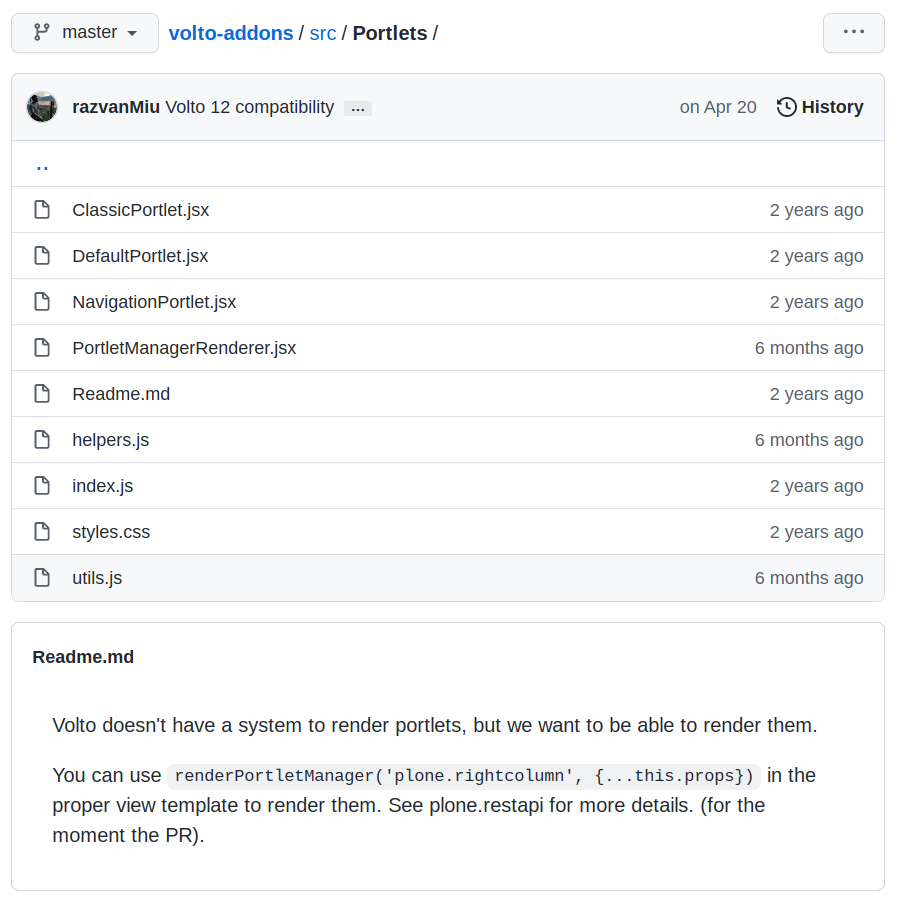
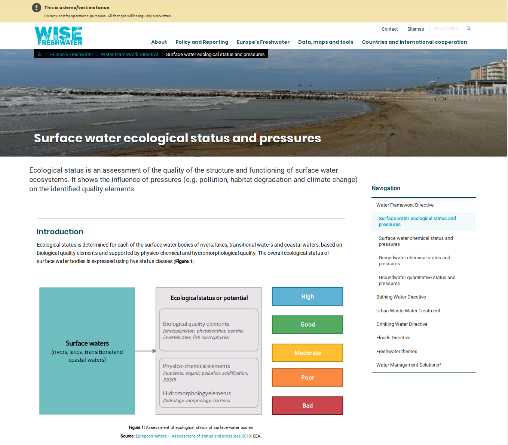

---
class:
  - invert
headingDivider: 2
theme: gaia
style: |
---
<style>
  .hljs-name {
    color: #7ee787 !important;
  }

  .hljs-tag {
    color: #79c0ff !important;
  }

  h2 {
    font-family: serif;
  }
  section.leftbg h2 {
    text-align: left !important;
  }

  .leftbg h2 {
  }

  section {
    font-size: 1.6rem;
  }
  section.invert {
    --color-background: #175E58!important;
    padding: 2em 3em !important;
  }

  section code {
    color: #c9d1d9 !important;
    background: #161b22 !important;
  }
  img {
    max-height: 80vh;
    max-width: 100%;
    text-align: center;
  }
  a { color: white }
</style>
<!-- _class: lead invert

backgroundImage: linear-gradient(to bottom, #175E58, #29A399)
-->
# Volto Slots

## Volto has no viewlet-equivalent


<!-- _class: lead invert -->

<!-- Problem -->

## Solution

```jsx
import { ContextNavigation } from '@plone/volto/components';

config.slots.asideRightSlot: {
    title: 'Right column',
    manage: false,
    items: [{
         id: 'ContextNavigation',
         component: ContextNavigation,
     }]
   }
```

## Volto has no portlets


<!-- Problem -->
<!-- _class: lead invert -->

## Not really...

If you want them bad enough, you can have them

##

#### Portlets in plone.restapi

plone/plone.restapi#portlets_pr_clean

#### Portlets published in Volto

eea/volto-addons-forest/../Portlets



## Volto's slot-based solution

```jsx
config.slots.asideRightSlot: {
    title: 'Right column',
    manage: true,
    items: []
  }}
```
<!--
Notice the "manage:true"
-->

## Idea: let's reuse Volto blocks for layout

<!-- _class: lead invert -->

<!--
Back in 2003 when I've started with Zope and Plone, I was working
with my wife for an NGO and in those days, Plone was almost the final face of
our websites. You could just take default Plone, tweak the styling, add a logo,
add a few specific portlets, like newsletter signup, news, whatever and call it
a day.

And that Plone use case I think should still be supported by the future Plone.
Small websites, large intranet, Plone was able to shape itself into any of
that. We make our money today from consultancy with Plone, but I wish that we
don't forget those that we don't see, the ones that are not strong developers
and just treat Plone and hopefully Plone 6 with Volto, as the final product.

Side note, after all these years of watching the Plone community, I'm still
amazed when I see new people coming to the Plone community forum. Is there
still interest in small instalations of Plone, or did we become something where
you need to dump at least 100k just to get the basics running?

I hope with Erico's recent work and Volto's seamless mode we might get to
a place where we can look at Volto and have it be almost be a final product.
There is certainly a sweet spot between Gutenberg's full page layout
editing and Plone's strong classic CMS roots, somewhere where Volto can
be positioned. And I'm extremely grateful to all the guys at Kitconcept and
those that worked on Volto so far, for placing UX and user friendliness as
a top priority. It is a continuation of Alex Limi's vision and work and it's
staying true to the core Plone traits and values.

----
NUUU: Now, I'm not gonna defend one website design over another. As much as I like to
get myself involved in everything, I have to admit I'm not a designer. I'm
actually a backend developer who invaded the frontend domain.

-->

## Idea: let's reuse Volto blocks for layout

<!-- _class: lead invert -->

<!--
Thinking back to Nicola's Sustainable Web presentation, you know, we've used
the same office computers for many years, but when we started to work with
Volto we've had to upgrade all computers, just to keep up with webpack bundling
speeds. Yes, we are the developed world, but are we building a product that is
designed only for the developed world type of developers?

Now, I like to think that there's a place for more control over the site
layout in Volto. I've seen already many times the lifecycle of many website:
they get created, a ton of effort and money is spent at their creation, then
they're abandoned into the hands of content creators and website managers. If
we don't provide tools for these people to have at least a bit of chance of
pushing a website forward, on their own, we're basically delivering stillborns:
websites already dead by the time they're launched.

And portlets are not even a presentational thing, they're "inheritable bits of
content or miniapps". The portlet term, at its roots, was a way of running
separate apps, inside the same engine, right? I see Volto blocks as
a derivative of that idea. And we all have these on all of our websites, from
top level menus, footers, message boxes, etc. Do we want to always push these
things in the developer hands, or can we let website administrators handle
some of these? Fortunately, for top-level dropdown menu and footers we already
have nice solutions provided by products from RedTurtles.

But let's see if we can reuse the Volto blocks as an engine for "layout
things".
-->

## Let's rewind

* Volto has no site-wide layout customization
* Some Volto sites need site-wide content things
* Volto embraces newbies & frontend developers

<!--

-[tibi:next]
* Volto has no site-wide layout customization

-[tibi:next]
* Some Volto sites need site-wide content things

Not every project needs them, but
it's good to have them in the "arsenal".

-[tibi:next]
With Volto we're trying to empower the frontend developers, so people with no
knowledge of Plone can make a significant contributions to Plone
projects. With Volto it is actually possible for someone with almost 0 Plone
"backend" knowledge to create and develop a real project.
-->

## Volto's slots proposition

* Simplify configuration.
* Volto blocks are very expressive. We can fill the gaps
* "Modify portal content" for slots
* UI power = more capabilities:
  - atomic blocking of parent blocks
  - override parent blocks
  - reorder parent with local blocks

<!--
What can we do to improve the portlet story? These are the improvements that we
can make with the slots:

-[tibi:next]

- Simplify configuration of slots. That's just 2 lines of JSON configuration in
  Volto

-[tibi:next]

- reuse the existing Volto blocks in slots
- Cover missing gaps with new dedicated Volto blocks, such as navigation

-[tibi:next]

- Allow selectively managing slots as content, editable with the `Modify
  portal content` permission.

-[tibi:next]
- Having Volto and React power, it's easier to create UI that expresses more
  complex scenarios:
    - atomic blocking of inherited blocks, instead of all or nothing
    - create local copies of blocks
    - mix order of "local" and inherited blocks
-->

## How can we use them?

- Sidebars: listings, info boxes, navigation, etc
- section headers, content
- site chrome: fat menus, footers
- as a generic, context dependent, TTW registry of all things

<!--
What can we do with them?

- sidebars: info boxes, navigation, etc
- "fat menus".
- section headers, content
- footers
- Wild scenarios, such as using the slots endpoint as a registry for site-wide
  configuration. A "TTW block designer" could use the slots as a storage for
  presets.
-->


## Current status

- plone.restapi PR, > 100 commits ahead master
- Volto PR, > 260 commits ahead master
- Overall, `basic` functionality around 60-70% ready

## Already in use live!



<!--
https://demo-freshwater.eea.europa.eu/europe-freshwater/water-framework-directive/surface-water-ecological-status-pressures
-->

## Live demo

Warning! None of this is final UI/UX or functionality.
Consider it pre-alpha.

## Thank you!
